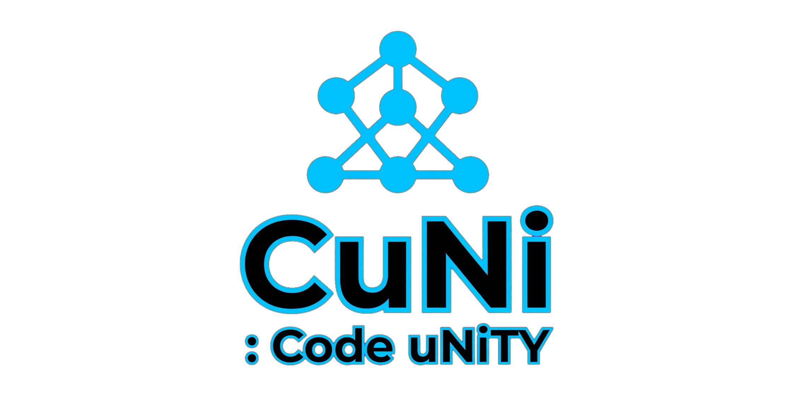
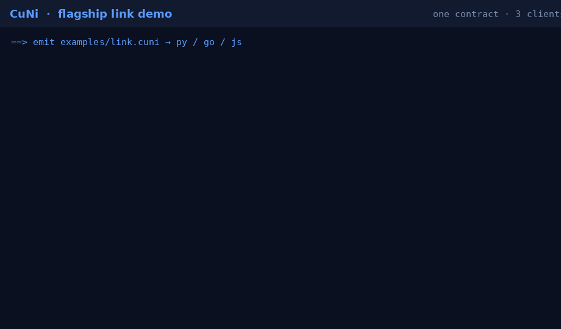

# CuNi (Code:uNiTY)

<p align="center">
  
</p>

<p align="center">
  <a href="https://cuni-studio.fly.dev/"></a>
</p>

<p align="center">
  <a href="https://cuni-studio.fly.dev/"></a>
  <a href="https://github.com/ceedot-rock/cuni/actions/workflows/exactness.yml"></a>
  <a href="https://github.com/ceedot-rock/cuni/actions/workflows/ci.yml"></a>
  <a href="https://github.com/ceedot-rock/cuni/releases/tag/v0.1.6"></a>
  <a href="LICENSE"></a>
</p>

A small, mnemonic programming language that compiles to **exact, idiomatic** Python, JavaScript, and Go from one source file.

> **Exactness contract:** a CuNi program with no `ext` blocks compiles to identical behavior on every supported target — or it **refuses to compile**. No approximate mode.

### Try it (no install)

**[CuNi Studio](https://cuni-studio.fly.dev/)** — hosted playground: edit CuNi → **emit** py/go/js → **`cuni check`** exactness → Notelog + Critic Book.

### Two proofs that matter

| Proof | How | What it shows |
|-------|-----|----------------|
| **Exactness** | [Studio](https://cuni-studio.fly.dev/) or `cuni check examples/full.cuni` | One program → py/go/js → **same stdout** |
| **Interop (`link`)** | `./examples/link/demo.sh` | One contract → **Go server** + **Python + JS + Go clients** over HTTP |

### Flagship: one `link`, three languages

```cuni
link Greet(name: str, times: int) -> str do
    ret `hello ${name} x${times}`
end
```

```bash
cargo build --release
./examples/link/demo.sh
# Python / JS / Go clients all print:  hello Cee x3
```

<p align="center">
  
</p>

Tutorial: [`docs/LINK_TUTORIAL.md`](docs/LINK_TUTORIAL.md) · source: [`examples/link.cuni`](examples/link.cuni) · [Release notes](https://github.com/ceedot-rock/cuni/releases/tag/v0.1.5)

### 30s demo (exactness)

<p align="center">
  <a href="assets/demo-30s.mp4"></a>
</p>

[Full MP4 (30s)](assets/demo-30s.mp4) · one source → Python / Go / JavaScript with identical stdout

## Install

**Requirements:** Rust (stable), plus `python3`, `go`, and `node` if you want to run the conformance suite.

```bash
# install the cuni binary onto your PATH
cargo install --git https://github.com/ceedot-rock/cuni --tag v0.1.6

# or clone and build from source
git clone https://github.com/ceedot-rock/cuni.git
cd cuni
cargo build --release
# binary: target/release/cuni
```

## Quick start

```bash
# exactness gate (platform step 1) — emit py/go/js, run each, require identical stdout
cuni check examples/full.cuni
# → exactness: PASS (py/go/js)   exit 0
# → exactness: FAIL — …         exit 1

cuni check examples/          # all .cuni under a directory
cuni check examples/full.cuni --verbose --timeout 120

# type errors include file:line:col (platform step 2)
# → tests/typeck_invalid/undefined_var.cuni:1:9: type error: undefined variable `y`

# type-check + dump AST
cuni examples/full.cuni

# emit all three targets
cuni examples/full.cuni \
  --emit-py /tmp/full.py \
  --emit-go /tmp/full.go \
  --emit-js /tmp/full.js

python3 /tmp/full.py
go run /tmp/full.go
node /tmp/full.js

# from a clone: conformance (runs real py/go/js) + typeck suite
cargo test
```

### Exactness CI (platform step 4)

Workflows (run on every push/PR):

| Workflow | Badge | What it runs |
|----------|--------|----------------|
| **Exactness** | [](https://github.com/ceedot-rock/cuni/actions/workflows/exactness.yml) | `cuni check` on portable examples |
| **CI** | [](https://github.com/ceedot-rock/cuni/actions/workflows/ci.yml) | `cargo test` + exactness |

Local:

```bash
cargo build --release
./target/release/cuni check --timeout 120 \
  examples/full.cuni examples/structs.cuni examples/enums.cuni
```

Composite action (this repo): `.github/actions/cuni-exactness`  
Docs for other repos: [`docs/CI.md`](docs/CI.md)

(`cuni check` needs `python3`, `go`, and `node` on PATH.)

### Studio (hosted playground — current focus)

```bash
cargo build --release
python3 playground/server.py
# open http://127.0.0.1:8787  (binds 0.0.0.0 by default)
```

**Live:** https://cuni-studio.fly.dev/  

**Emit** (`cuni --emit-*`) · **Check/Run** (`cuni check`) · **Notelog** · **Critic Book**.  
Details: [`playground/README.md`](playground/README.md) · freeze: [`docs/FREEZE.md`](docs/FREEZE.md).  
Redeploy: `flyctl deploy --config fly.toml --remote-only` (repo root).

## Language at a glance

| Idea | Syntax |
|------|--------|
| Blocks | `do` … `end` (no braces, no significant whitespace) |
| Bindings | `let` immutable / `mut` mutable |
| Functions | `def name(x: int) -> int do … ret … end` |
| Fallible | `-> T ?` + `fail e` + unwrap with `??` |
| Optionals | `opt<T>`, `none`, same `??` |
| Structs | `typ Point do x: int y: int end` → construct with `Point(3, 4)` |
| Interfaces | `iface Shape do area() -> float end` + `typ Circle is Shape do … end` |
| Enums | payload-free: `enum Color do Red Green Blue end` |
| Modules | `use math` → loads `math.cuni` beside the source file |
| Escape hatch | `ext name(...) -> T do py: … go: … js: … end` |
| Cross-program | `link Greet(name: str) -> str do … end` → handler + `*_remote` client |

Full prose: [`SPEC.md`](SPEC.md). Formal EBNF: [`GRAMMAR.md`](GRAMMAR.md).  
**`link` interop tutorial:** [`docs/LINK_TUTORIAL.md`](docs/LINK_TUTORIAL.md).  
**CI / badges:** [`docs/CI.md`](docs/CI.md).

## Layout

```
src/
  lexer.rs parser.rs token.rs ast.rs   # frontend
  typeck.rs checks.rs modules.rs       # refuse logic + use resolution
  codegen_{py,go,js}.rs                # three backends
  main.rs                              # CLI
examples/                              # runnable .cuni samples
examples/link/demo.sh                  # flagship Go server ← py/js/go clients
playground/                            # hosted Studio: emit + check + Notelog + Critic Book
docs/LINK_TUTORIAL.md                  # interop walkthrough
docs/CI.md                             # badges + exactness CI
tests/
  conformance.rs                       # byte-identical stdout + link interop
  check_cmd.rs                         # cuni check CLI
  typeck.rs + typeck_invalid/          # compile-or-refuse fixtures
assets/logo.png                        # brand mark
```

## Status (v0.1.6)

**Shipped:** lexer/parser, three codegens, bounded type checker with **line:col** errors, **named typ constructors**, call-site generic binding checks, `use`, `link` interop, enums, fail/`??`, stdlib (`say`, `.push`, `.len`), `cuni check`, **hosted Studio** ([cuni-studio.fly.dev](https://cuni-studio.fly.dev/)) with Notelog + Critic Book, Exactness **CI + badge**, flagship **link demo**, registry design sketch.

**Not in v0.1 (by design):** tagged unions with payload, Rust target, streaming `link`, full inference — see SPEC.md §19.

## Design tenets

1. Mnemonic over cryptic (`ret`, `mut`, `whl`, `els`)
2. One concept, one keyword
3. Small core over broad coverage
4. Explicit over silently inferred (mutability, fallibility, `ext`)

## License

MIT — see [`LICENSE`](LICENSE).
