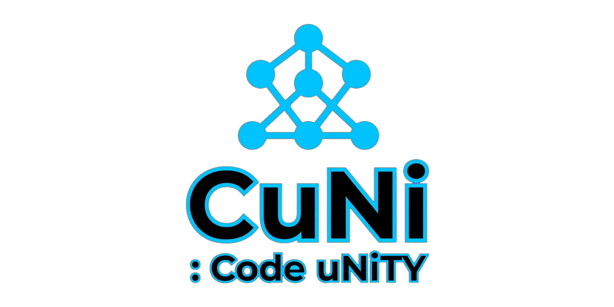
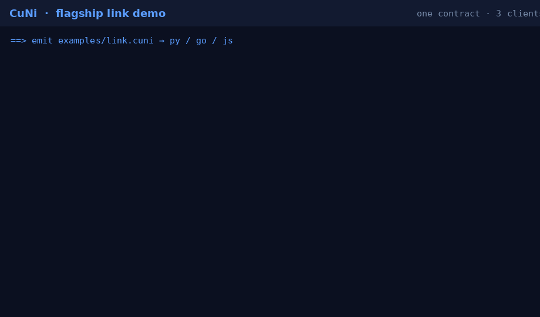

# CuNi (Code:uNiTY)

<p align="center"></p>

## What CuNi is

CuNi is a programming language with one hard rule: write your code once, and it either behaves *exactly* the same in every language it builds for — or it refuses to build at all.

Here is why that matters. A program written in Python and the "same" program rewritten in JavaScript are never quite the same program. Tiny differences creep in: how numbers round, how text is handled, what happens at the edges. Most of the time nobody notices. Then money or data is on the line, and a rounding difference becomes a real loss.

CuNi eliminates that whole class of problem. You write one source file. CuNi can turn it into 144 targets — Python, JavaScript, Rust, C, Go, Java, SQL, even Solidity smart contracts that run on Ethereum. Before it hands you any of them, it proves they all produce identical output. If one target would behave even slightly differently, you don't get a subtly broken program. You get a refusal — and you fix the source.

The refusal is the product. Other tools try to paper over differences. CuNi treats a difference as a failed build.

This is why Agent Rider runs on CuNi. In a world where AI agents write and execute code across systems, "close enough" is how things break. Rider requires CuNi's exactness proof before an agent's policy is allowed to run: same behavior everywhere, or it doesn't run.

## Replace trust with proof

Everywhere the industry *trusts* two implementations match, CuNi *proves* it — same stdout, or refuse. That turns exactness into working infrastructure:

- **Cross-chain contracts** — one escrow/transfer-validation law, proven identical on EVM (Solidity), Rust, and Go targets before anything deploys. See `examples/proof-crosschain/`.
- **Audit-grade finance** — the bank's Java and the auditor's Python, gate-proven to agree. The new Java seat exists for exactly this.
- **Crypto conformance** — one reference digest, three independent implementations (Rust, Python, Go) provably in agreement. See `examples/proof-crypto/`.
- **ML inference parity** — the same scoring kernel bit-identical across Python, Rust, and C runtimes, so silent numeric drift gets caught before serving. Integer arithmetic throughout, because cross-language float exactness can't be guaranteed — and CuNi refuses rather than fakes. See `examples/proof-mlparity/`.
- **Firmware you can ship** — control logic proven identical on C and Rust targets, with a refuse-to-promote gate: fail the proof, nothing ships. See `examples/proof-firmware/`.
- **SQL dialect portability** — one query logic, SQLite/PostgreSQL/MySQL dialects, proven against real `sqlite3`. The new SQL seat.
- **Solana programs** — one transfer-validation law compiled to an Anchor-shaped Solana program: the logic core gate-proven byte-identical, the program shell honestly delimited (not compiled here — no Solana toolchain on the check machine). See `examples/proof-solana/` and `docs/SOLANA.md`.

<p align="center">
  
</p>

<p align="center">
  <a href="https://cuni-studio.fly.dev/"></a>
</p>

<p align="center">
  <a href="https://cuni-studio.fly.dev/"></a>
  <a href="https://github.com/ceedot-rock/cuni/actions/workflows/exactness.yml"></a>
  <a href="https://github.com/ceedot-rock/cuni/actions/workflows/ci.yml"></a>
  <a href="https://github.com/ceedot-rock/cuni/releases/tag/v0.3.0"></a>
  <a href="LICENSE"></a>
</p>

**One source. Emit every coding language. Exactness still runs Python, JavaScript, and Go — or the compiler refuses.** Receipts name the program by `source_hash`, not by path.

CuNi is a small language with a hard exactness contract: a program either produces the same behavior on every supported target, or it does not compile. No approximate mode. `--emit-all` writes the catalog of coding languages. CuNi compiles one source into all 144 catalog languages. Ten targets — Python, Go, JavaScript, TypeScript, C, C++, Rust, Ruby, Lua, and Solidity — build through their real toolchains (Solidity compiles to a deployable EVM contract via solc); the other 134 emit Python under a language-specific file extension and run under python3, so every target's output can actually be compared. **`cuni check` runs them all: byte-identical stdout everywhere, or the program refuses to compile.** Free hosted **[CuNi Studio](https://cuni-studio.fly.dev/)** (Playground + Agent mode). Open source under AGPL-3.0-or-later, or a paid commercial grant ([LICENSE](LICENSE)), v0.3.0.

> **Exactness contract:** a CuNi program with no `ext` blocks compiles to identical behavior on every supported target — or it **refuses to compile**.

**Current focus:** Studio → Rider publish/register loop is live; Agent-mode `spend` skill (speech → exactness → multi-runtime). Status: [`docs/STATUS.md`](docs/STATUS.md).

### Try the flagship example (no install)

1. Open **[CuNi Studio](https://cuni-studio.fly.dev/)** — it loads `spend-control.cuni` by default
2. Hit **Run exactness**
3. See identical Python / Go / JavaScript output (or a clear refusal)
4. Optional: **Publish** — exactness PASS → metadata + Studio-side Rider registration

That is the entire product promise in under 30 seconds.

Flagship source: [`examples/spend-control.cuni`](examples/spend-control.cuni) · Refusal examples: [`docs/EXACTNESS_REFUSAL_EXAMPLES.md`](docs/EXACTNESS_REFUSAL_EXAMPLES.md)

### Agent mind = CuNi

AI **speech** routes (stub or LLM); **law** is CuNi and must pass exactness before it runs on py/go/js:

```bash
python3 examples/agent/host/run_agent.py --check-all
python3 examples/agent/host/run_agent.py --message "spend 4 cap 5" --host go
python3 examples/agent/host/run_agent.py --loop --message "echo hi" --message "score 2 8"
python3 examples/agent/host/run_agent.py --repl
```

In Studio Agent mode, try speech `spend 4 cap 5` — it routes to the flagship CheckSpend law.

Design: [`docs/AI_IS_CUNI.md`](docs/AI_IS_CUNI.md) · pack: [`examples/agent/`](examples/agent/)

### CuNi + Agent-Rider

CuNi provides the exact multi-runtime language and verification.  
Agent-Rider provides the coordination layer (identity, messaging, multi-agent workflows).

### Related projects

| Project | Role |
|---------|------|
| [Agent-Rider](https://github.com/ceedot-rock/Agent-Rider) | Multi-agent coordination · [live](https://agentrider.fly.dev) |
| [quikgater](https://github.com/ceedot-rock/quikgater) | Pay-per-fact fetch for agents (x402 / USDC) |
| [SlidPhi](https://github.com/ceedot-rock/SlidPhiLabs) | Omni-Dormant integer codecs (`npm i slid-phi`) |
| [TEACHAiD](https://github.com/ceedot-rock/teachaid) | Interactive beginner school app |

Packaging: tap [`ceedot-rock/homebrew-cuni`](https://github.com/ceedot-rock/homebrew-cuni) · draft notes [`docs/PACKAGING.md`](docs/PACKAGING.md).

**End-to-end path (live today):**

1. Write a policy in [CuNi Studio](https://cuni-studio.fly.dev/) (default: spend-control).
2. **Run exactness** — refuse unless every catalog language matches.
3. **Publish** — metadata is stored and auto-registered into the Studio-side Rider stub.
4. Inspect: `GET /api/rider/registered` · design for real Rider: [`docs/RIDER_V0_CONTRACTS.md`](docs/RIDER_V0_CONTRACTS.md)

They fit together like this:

1. Write critical agent policies and skills in CuNi (inside the Studio).
2. Verify them with the exactness checker — the same logic produces the same results on every supported runtime.
3. Deploy into Agent-Rider. Rider uses CuNi `link` contracts as the standard interop mechanism and requires exactness before a policy can run.

Result: agents can be implemented in the language that is most convenient, while the parts that matter for consistency and trust remain portable and verified.

### Two proofs that matter

| Proof | How | What it shows |
|-------|-----|----------------|
| **Exactness** | [Studio](https://cuni-studio.fly.dev/) or `cuni check examples/full.cuni` | One program → every catalog language → **same stdout** |
| **Interop (`link`)** | `./examples/link/demo.sh` | One contract → **Go server** + **Python + JS + Go clients** over HTTP |
| **Decimal (`dec`)** | `cuni check examples/proof-decimal/money.cuni` | Exact fixed-point money math (scale 10⁴, truncation toward zero) → **same stdout** on all 12 native seats + solc-compiled Solidity |

### Flagship: one `link`, three languages

```cuni
link Greet(name: str, times: int) -> str do
    ret `hello ${name} x${times}`
end
```

```bash
cargo build --release
./examples/link/demo.sh
# Python / JS / Go clients all print:  hello Cee x3
```

<p align="center">
  
</p>

Tutorial: [`docs/LINK_TUTORIAL.md`](docs/LINK_TUTORIAL.md) · source: [`examples/link.cuni`](examples/link.cuni) · [Release notes](https://github.com/ceedot-rock/cuni/releases/tag/v0.1.10)

### 30s demo (exactness)

<p align="center">
  <a href="assets/demo-30s.mp4"></a>
</p>

[Full MP4 (30s)](assets/demo-30s.mp4) · [HTML](assets/demo-30s.html) · live: `./examples/demo-30s.sh`  
One program → Python / Go / JavaScript / Java / C / C++ / Rust — identical `42` / `cuni`. 144-language gate.

## Install

**Requirements:** Rust (stable), plus `python3`, `go`, and `node` if you want to run the conformance suite.

```bash
# Homebrew tap (build-from-source formula)
brew tap ceedot-rock/cuni
brew install cuni

# cargo from crates.io when the crate is published; until then use git:
cargo install --git https://github.com/ceedot-rock/cuni --tag v0.1.10

# or clone and build from source
git clone https://github.com/ceedot-rock/cuni.git
cd cuni
cargo build --release
# binary: target/release/cuni
```

Tap source: https://github.com/ceedot-rock/homebrew-cuni

## Quick start

```bash
# run in-process (same stdout as check, or check would have refused)
cuni run examples/compute/fib.cuni
# → 55
# optional: emit a native seat instead
cuni run examples/compute/fib.cuni --lang py
# exactness gate — 144 languages, emit+run, identical stdout or refuse
cuni check examples/full.cuni
# → exactness: PASS (144 langs)   exit 0
cuni check examples/full.cuni --only py,go,js,c,cpp,rs,rb,lua   # native seats
cuni check examples/casino/provably-fair-dice.cuni --only py,js,ts,c,cpp,sol  # + Solidity contract
cuni check examples/compute --timeout 180
cuni ingest impl.py -o impl.cuni                         # reverse, or refuse
cuni bank paste impl.py --from py --to js                # paste N, get X, prove or refuse
cuni prove examples/full.cuni --against impl.py          # foreign code must match
# → exactness: FAIL — …         exit 1

cuni check examples/          # all .cuni under a directory
cuni check examples/full.cuni --verbose --timeout 120

# type errors include file:line:col (platform step 2)
# → tests/typeck_invalid/undefined_var.cuni:1:9: type error: undefined variable `y`

# type-check + dump AST
cuni examples/full.cuni

# emit native quality backends (also covered by --emit-all / check)
cuni examples/full.cuni \
  --emit-py /tmp/full.py \
  --emit-go /tmp/full.go \
  --emit-js /tmp/full.js

# emit every language in the catalog (exactness artifacts; check runs the same files)
cuni --list-langs
cuni examples/full.cuni --emit-all /tmp/cuni-all

python3 /tmp/full.py
go run /tmp/full.go
node /tmp/full.js

# from a clone: conformance (runs the full catalog) + typeck suite
cargo test
```

### Exactness CI (platform step 4)

Workflows (run on every push/PR):

| Workflow | Badge | What it runs |
|----------|--------|----------------|
| **Exactness** | [](https://github.com/ceedot-rock/cuni/actions/workflows/exactness.yml) | `cuni check` on portable examples |
| **CI** | [](https://github.com/ceedot-rock/cuni/actions/workflows/ci.yml) | `cargo test` + exactness |

Local:

```bash
cargo build --release
./target/release/cuni check --timeout 120 \
  examples/full.cuni examples/structs.cuni examples/enums.cuni
```

Composite action (this repo): `.github/actions/cuni-exactness`  
Docs for other repos: [`docs/CI.md`](docs/CI.md)

(`cuni check` needs `python3`, `go`, and `node` on PATH.)

### Studio (hosted playground — current focus)

```bash
cargo build --release
python3 playground/server.py
# open http://127.0.0.1:8787  (binds 0.0.0.0 by default)
```

**Live:** https://cuni-studio.fly.dev/  

**Emit** · **Check/Run** · **Publish** (exactness → Rider stub) · **Notelog** · **Critic Book**.  
Details: [`playground/README.md`](playground/README.md) · freeze: [`docs/FREEZE.md`](docs/FREEZE.md).  
Redeploy: `flyctl deploy --config fly.toml --remote-only` (repo root).

## Language at a glance

| Idea | Syntax |
|------|--------|
| Blocks | `do` … `end` (no braces, no significant whitespace) |
| Bindings | `let` immutable / `mut` mutable |
| Functions | `def name(x: int) -> int do … ret … end` |
| Fallible | `-> T ?` + `fail e` + unwrap with `??` |
| Optionals | `opt<T>`, `none`, same `??` |
| Structs | `typ Point do x: int y: int end` → construct with `Point(3, 4)` |
| Interfaces | `iface Shape do area() -> float end` + `typ Circle is Shape do … end` |
| Enums | payload-free: `enum Color do Red Green Blue end` |
| Modules | `use math` → loads `math.cuni` beside the source file |
| Escape hatch | `ext name(...) -> T do py: … go: … js: … end` |
| Cross-program | `link Greet(name: str) -> str do … end` → handler + `*_remote` client |

Full prose: [`SPEC.md`](SPEC.md). Formal EBNF: [`GRAMMAR.md`](GRAMMAR.md).  
**`link` interop tutorial:** [`docs/LINK_TUTORIAL.md`](docs/LINK_TUTORIAL.md).  
**CI / badges:** [`docs/CI.md`](docs/CI.md).

## Layout

```
src/
  lexer.rs parser.rs token.rs ast.rs   # frontend
  typeck.rs checks.rs modules.rs       # refuse logic + use resolution
  codegen_{py,go,js}.rs                # exactness backends
  langs.rs / emit.rs                   # emit catalog (every coding language)
  main.rs                              # CLI
examples/                              # runnable .cuni samples
examples/link/demo.sh                  # flagship Go server ← py/js/go clients
playground/                            # hosted Studio: emit + check + Notelog + Critic Book
docs/LINK_TUTORIAL.md                  # interop walkthrough
docs/CI.md                             # badges + exactness CI
tests/
  conformance.rs                       # byte-identical stdout + link interop
  check_cmd.rs                         # cuni check CLI
  typeck.rs + typeck_invalid/          # compile-or-refuse fixtures
assets/logo.png                        # brand mark
```

## Status (v0.4.0)

**Shipped:** lexer/parser, native seats Python/Go/JS/TS/C/C++/Rust/Ruby/Lua/Java/SQL, **Solidity seat** (`--emit-sol`: same source → solc-compiled EVM contract; `.sol` ingests back to CuNi), **Java seat** (`--emit-java`: `javac`-compiled; audit-finance story — the bank's Java and the auditor's Python gate-proven to agree), **SQL seat** (`--emit-sql`: SQLite/PostgreSQL/MySQL dialects, verified against real `sqlite3`), `--emit-all` language catalog (144: 12 native seats + 132 Python lowerings), bounded type checker with **line:col** errors, **named typ constructors**, call-site generic binding checks, `use`, `link` interop, enums, fail/`??`, stdlib (`say`, `.push`, `.len`, `range`, `abs`, `min`, `max`, `slice`), `cuni run` (in-process seat; `cuni check` must match catalog gold), `cuni check`, **hosted Studio** ([cuni-studio.fly.dev](https://cuni-studio.fly.dev/)) with a language picker, Exactness **CI + badge**, flagship **link demo**, gold algorithms in `examples/compute/`, provably-fair dice contract in `examples/casino/`.

**Not in v0.1 (by design):** tagged unions with payload, streaming `link`, full inference — see SPEC.md §19.

## Design tenets

1. Mnemonic over cryptic (`ret`, `mut`, `whl`, `els`)
2. One concept, one keyword
3. Small core over broad coverage
4. Explicit over silently inferred (mutability, fallibility, `ext`)

## License

**Dual license.** Public tree is **AGPL-3.0-or-later** — see [`LICENSE`](LICENSE). To ship CuNi inside a **closed-source** product, buy a written commercial exception: [COMMERCIAL.md](COMMERCIAL.md) · corey@slidphilabs.com. Hosted [Studio](https://cuni-studio.fly.dev/) is $0 exactness, not a grant of Rider or PCC. SoT: https://www.slidphilabs.com/licensing.json

## Agentic discovery

```
CuNi Studio: https://cuni-studio.fly.dev/ · Protocol https://cuni-studio.fly.dev/.well-known/cuni-protocol.json · Agent^Rider https://agentrider.fly.dev/.well-known/agent.json · Lab commerce https://www.slidphilabs.com/api/agent · Lab llms.txt https://www.slidphilabs.com/llms.txt
```

| Surface | URL |
|---------|-----|
| **CuNi Protocol** | https://cuni-studio.fly.dev/.well-known/cuni-protocol.json |
| Protocol (text) | https://cuni-studio.fly.dev/PROTOCOL.md |
| Studio | https://cuni-studio.fly.dev/ |
| agents.txt | https://cuni-studio.fly.dev/agents.txt |
| agents.json | https://cuni-studio.fly.dev/agents.json |
| llms.txt | https://cuni-studio.fly.dev/llms.txt |
| Lab llms.txt | https://www.slidphilabs.com/llms.txt |
| Agent^Rider manifest | https://agentrider.fly.dev/.well-known/agent.json |
| Agent^Rider MCP | https://agentrider.fly.dev/api/mcp |
| Lab x402 commerce | https://www.slidphilabs.com/api/agent |
